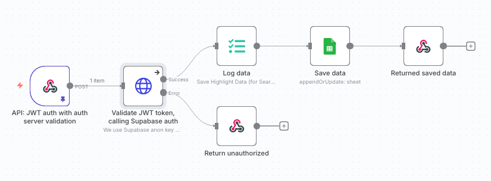
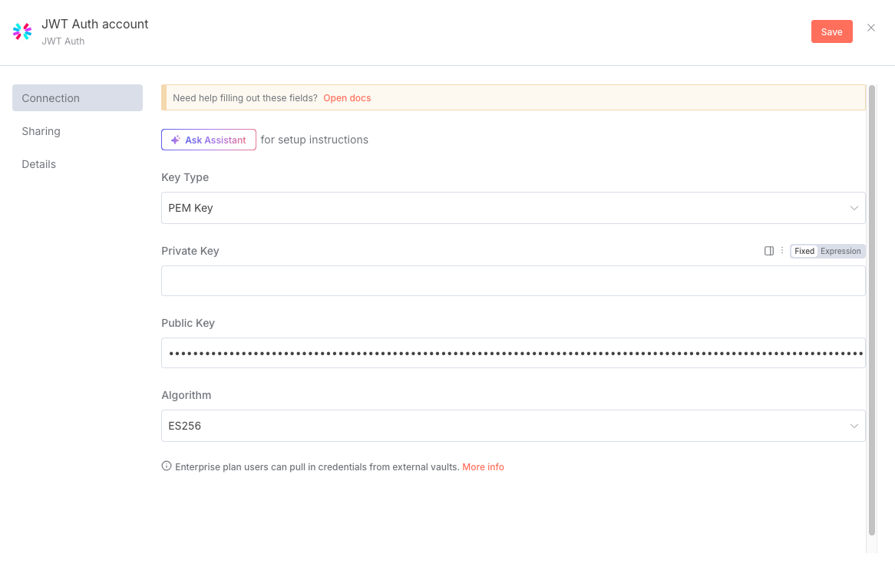
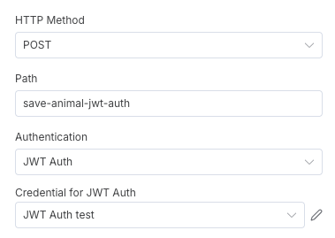
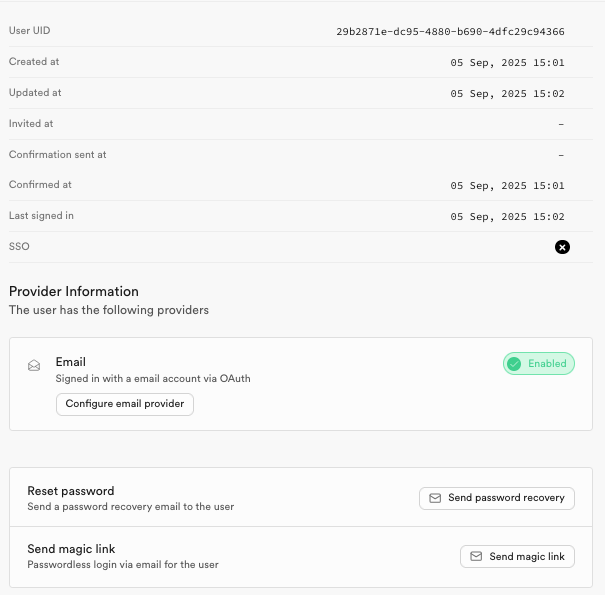
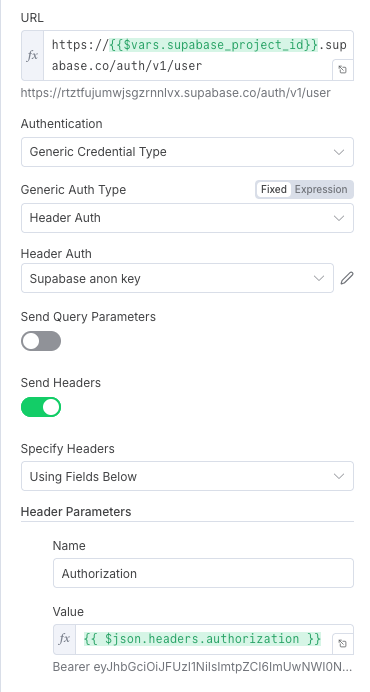

# N8N Webhook Security




Basic auth and header auth are basically the same.

## Basic Auth

```fish
echo '{"animal": "cat", "name": "garfield2", "weight": 12}' | http POST https://<n8n_instance>.app.n8n.cloud/webhook/save-animal-basic-auth -a <username>:<password>
```

## Header Auth

```fish
echo '{"animal": "cat", "name": "garfield", "weight": 13}' | http POST https://<n8n_instance>.app.n8n.cloud/webhook/save-animal-header-auth <header_name>:<header_value>
```

## JWT Auth

This is the easiest way to use JWT tokens. There is no server-side validation of the token.

### Configuration

1. Enable JWT signing keys. You might need to rotate the keys once when you get started, so the ECC (P-256) is set as the current key.
2. Download the public signing key at `https://<your_supabase_project_id>.supabase.co/auth/v1/.well-known/jwks.json`
3. Convert the public signing key from JWK to PEM format, for instance using https://8gwifi.org/jwkconvertfunctions.jsp (This is a public key, so there is nothing sensitive about that)
4. Create a new JWT credential in n8n with the PEM key [](images/n8n-jwt-credential.png) (leave "Private key" empty, it is not needed in that case)
5. Use the new JWT credential in the JWT Auth webhook node [](images/simple-jwt-config.png)


### Usage

6. To get a JWT token, we must ask it to be generated by SupaBase.One way to do that is actually to ask for a magic link once you have created a user in SupaBase authentication. [](images/magic-link.png)
7. Open the magic link
```fish
http GET https://rtztfujumwjsgzrnnlvx.supabase.co/auth/v1/verify?token=6308523035bf0747e6011aa9468d037f87d4f60f68a85f23e81102cd&type=magiclink&redirect_to=http://localhost:3000
<a href="http://localhost:3000#access_token=eyJhbGciOiJFUzI1NiIsImtpZCI6ImUwNWI0NTdmLTFhMTMtNGQ2Ni04NGMyLWYzYjJjNmI5ZTU3NSIsInR5cCI6IkpXVCJ9.eyJpc3MiOiJodHRwczovL3J0e....&amp;expires_at=1757104521&amp;expires_in=3600&amp;refresh_token=...&amp;token_type=bearer&amp;type=magiclink">See Other</a>.
```
8. Copy the access token and use it in the JWT Auth webhook node
```fish
echo '{"animal": "cat", "name": "garfield", "weight": 13}' | http POST https://<n8n_instance>.app.n8n.cloud/webhook/save-animal-jwt-auth "Authorization: Bearer $JWT_TOKEN"
```

## JWT Auth with Auth Server Validation

This is the most secure way to use JWT tokens, because it validates the token about the SupaBase auth server.
In practice, that means that if the user session was invalidated or the user was deleted, and so on, the validation will fail. 
If we don't contact the auth server, there is no way we can know about that.
The drawback is that it's an extra round trip to the server, so the webhook / API will take longer to answer.

### Configuration

The configuration is slightly easier than with the basic JWT setup :)
We need to define Supabase credentials (anon key) that will allow us to issue a call to the user endpoint of the auth Supabase API to validate the token.



### Usage

```fish
echo '{"animal": "cat", "name": "garfield", "weight": 13}' | http POST https://<n8n_instance>.app.n8n.cloud/webhook/save-animal-jwt-auth-with-auth-server-validation 'Authorization: Bearer $JWT_TOKEN'
```

